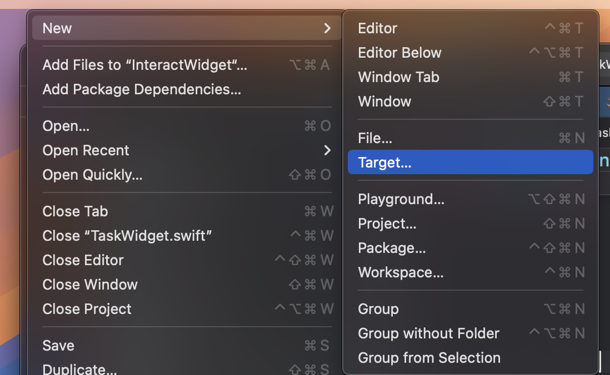
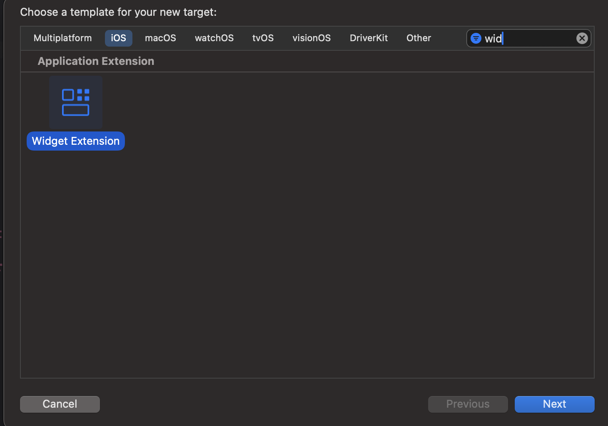
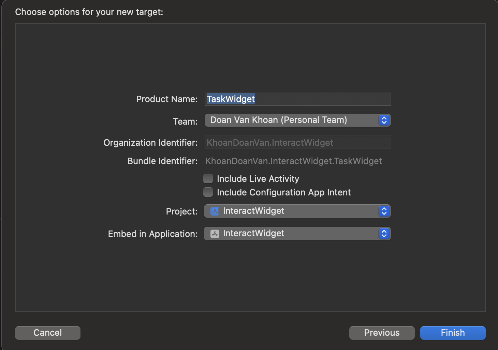
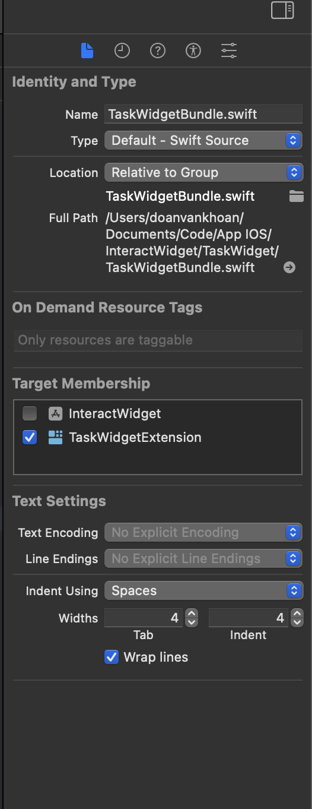
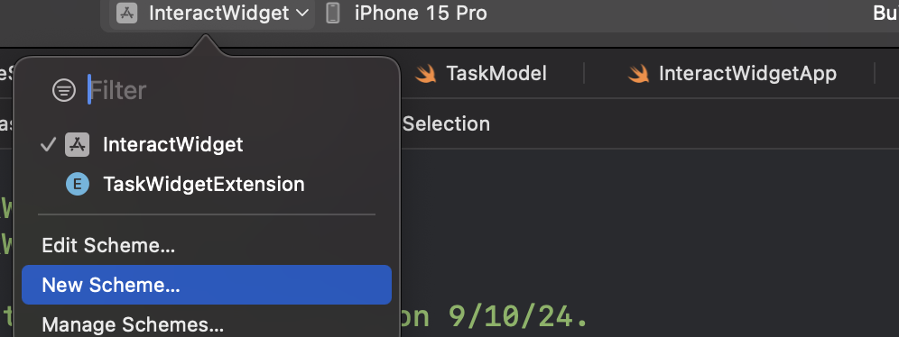
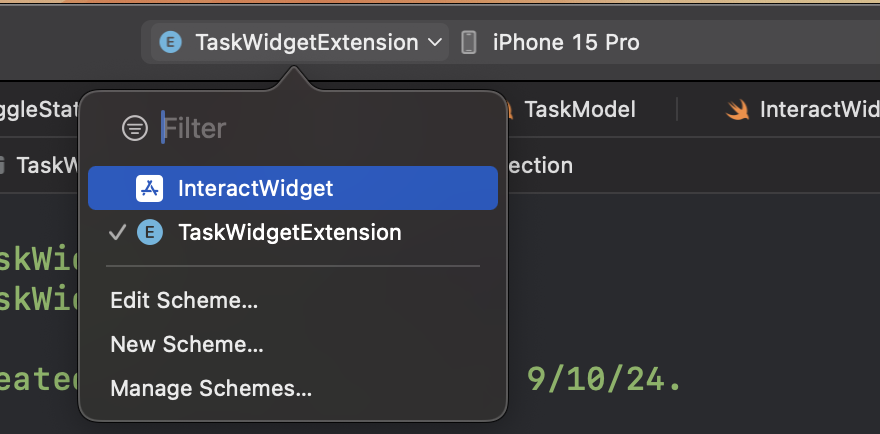

# InteractWidget

## How to add widget
- Click Target

- Choose Widget

- Not include Live Activity && Configuration App Intent

- Change target membership for all of files into Widget Folder

## Build
- Run the app then run the widget individual

